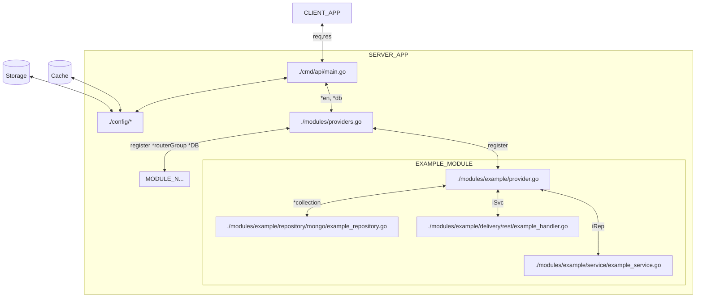

# SkilledIN Green Skills API

## Folder Structure

```
|--cmd/                    - this is where you compose several packages in to main package
|----api/                  - an example would be `api` for our main package/app
|------main.go             - holds app initialization
|--config/                 - this is where put your configuration 
|----config.go             - this file will load environtment 
|----fiber.go              - this file will init fiber engine
|----mongo.go              - this file will init database connection with mongo driver
|----redis.go              - this file will init data cache connection with redis
|--db/                     - this is where you store you database backups or migrations
|----migrations/           - this is where you store you migrations schema files
|--docs/                   - this is where api-spec autogenerated by swagger
|----docs.go               - this file hold generated api spec for embeded to main app
|----swagger.json          - this file hold json format api-spec 
|----swagger.yml           - this file hold yml format api-spec 
|--misc/                   - this is where you store your miscellaneous
|----make/                 - this is where you store your Makefile miscellaneous
|------tools.Makefile      - this is where you save tools needed for development purpose
|--modules/                - this folder holds list of all modules
|----example/              - this package holds all account module
|------common/             - this folder hold common data
|--------error.go          - this file holds error list for this current module (account)
|--------constant.go       - this file holds constant list for this current module (account), to avoid magic number, etc.
|------delivery/           - this holds delivery handler like rest, websocket, server-sent-event, webhook, etc...
|--------rest/             - this holds rest handler
|------domain/             - this folder holds module domains
|--------entity/           - this folder holds entity struct, representate of your database or models or data
|--------request/          - this folder holds form request stuct
|--------response/         - this folder holds custom data response 
|--------contract.go       - this fole hold interface contract for this module
|------repository/         - this folder holds data repository like mongo, postgre, etc.
|--------mongo/            - this folder all mongo query
|------service/            - this holds module usecase/service (logic)
|------provider.go         - this holds this current package initialization and dependencies registrar
|----...                   - others module
|----provider.go           - this file holds module registar and default handler
|--pkg/                    - this is where put your reusable packages 
|----http/                 - this folder hold list of http reusable packages
|------client/             - this package hold http client to call http/1 (rest, etc.)
|------middleware/         - this package holds list of reusable middleware for fiber engine
|------wrapper/            - this package holds reusable wrapper for respond, validation, etc.
|----password/             - this where put your password package like bcript, script, etc ...
|----token/                - this is where put your token package e.g: jwt, rsa, etc..
|--.air.windows.conf
|--.env
|--.gitignore
|--.golangci.yml
|--Dockerfile
|--go.mod
|--go.sum
|--Makefile
|--README.md
```

## Access Flow



## How To Use?

1. Run the app `make run`
2. Run with watch file change `make watch`
3. Crate a mocks `make mock` and then copy to parent folder from `genmocks`
4. Update API Spec `make api-spec` this will also run `make test`, `make lint` and `make critic`
   - `make test` is run all the tests function with its coverage
   - `make lint` is run linter for golang you probably need to install [golangci](https://github.com/golangci/golangci-lint) to run this on your local machine.
   - `make critic` is run code audit for golang, and also you probably need to install [go-critic](https://github.com/go-critic/go-critic) on your local machine.
5. You can also make API Spec without run this annoying lint and audit by type `make just-api-spec`, this action will run one and only one command.

PS: if you don't want to install required tools on your local machine you can use `make install-deps`, this will make all the required tool installed on this current package/project.

## Refs:
- [project-layout](https://github.com/golang-standards/project-layout)

#### More information [Project WIKI](https://github.com/Skilledin/skilledin-green-skills-api/wiki)
